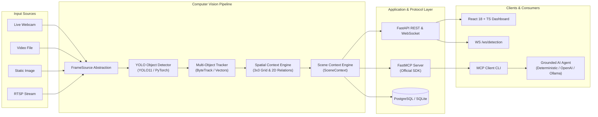

# YOLO + MCP Computer Vision Platform

> **Production-grade real-time computer vision service combining Ultralytics YOLO object detection with the official Model Context Protocol (MCP) to provide downstream AI agents with structured visual and spatial context.**

[](https://www.python.org/)
[](https://fastapi.tiangolo.com)
[](https://docs.ultralytics.com)
[](https://modelcontextprotocol.io/)
[](https://react.dev)
[](https://www.docker.com)
[](LICENSE)

---

## 1. Project Overview

The **YOLO + MCP Computer Vision System** transforms raw, pixel-level camera feeds, images, and videos into structured, verifiable spatial knowledge exposed via the open **Model Context Protocol (MCP)**. Downstream AI agents (Claude Desktop, Cursor, LangChain, Autogen, or custom agents) query physical scenes deterministically without token waste or hallucinations.

---

## 2. Why This Project Exists

Current approaches to connecting Large Language Models (LLMs) to visual streams suffer from three critical flaws:
1. **Bandwidth & Latency**: Transmitting continuous 30 FPS video frames directly to multimodal LLMs is cost-prohibitive and computationally unviable.
2. **Hallucination Risk**: Pure vision-language models frequently misestimate object counts, relative 2D positions, and directional geometry.
3. **Black-Box Reasoning**: When an agent guesses what is on a camera, there is no verifiable bounding box coordinate or confidence score backing the claim.

### The Solution: Vision → Structured Representation → MCP → Agent

```
Raw Camera Feed → YOLO Detector → 2D Spatial Engine → SceneContext → MCP Tools → AI Agent
```

1. **Computer Vision (YOLO)** does what it does best: fast, low-latency object detection and coordinate bounding.
2. **The Spatial Context Engine** derives deterministic 3x3 grid sectors, relative sizing, and pairwise 2D relationships (`near`, `left_of`, `right_of`, `above`, `below`).
3. **The MCP Server** exposes this context through typed tools (`count_objects`, `find_object_location`, `get_scene_summary`, `query_scene`) and resources.
4. **The Agent** reasons accurately over factual, grounded spatial data with zero hallucination.

---

## 3. Architecture Diagram



---

## 4. Key Features

- **Multi-Source Ingestion**: Unified `FrameSource` interface supporting USB webcams, RTSP network streams, static images, and video files.
- **Production YOLO Abstraction**: Thread-safe inference, automatic device selection (`auto`, `cpu`, `cuda`), confidence/IoU thresholding, and coordinate bounding.
- **Deterministic 2D Spatial Engine**:
  - Partitions frame into a 3x3 grid (`top-left`, `top-center`, `top-right`, `center-left`, `center`, `center-right`, `bottom-left`, `bottom-center`, `bottom-right`).
  - Computes pairwise 2D relationships: `left_of`, `right_of`, `above`, `below`, `near`, and `inside_of`.
- **Truthful Spatial Standard**: Strictly computes 2D image plane geometry, clearly distinguished from unverified 3D physical depth.
- **Official Python MCP Server**: FastMCP implementation exposing 11 typed tools and 5 read-only resources.
- **Deterministic Query Reasoner**: Answers natural language questions ("How many people?", "Where is the bus?") without requiring an LLM or API keys.
- **Optional LLM Agent Integration**: Grounded `AgentProvider` abstraction supporting Deterministic reasoning, OpenAI (`gpt-4o-mini`), and local Ollama (`llama3.2`).
- **Real-Time WebSockets**: Low-latency metadata streaming on `/ws/detection` without sending heavy video frames.
- **Full Observability**: Live latency metrics, P50 and P95 percentiles, FPS estimation, and Prometheus text export on `/api/v1/metrics`.
- **Relational Persistence**: SQLAlchemy 2.0 async models for sessions, snapshots, detections, and relationships with SQLite and PostgreSQL compatibility.
- **Interactive React Dashboard**: Built with React 18, TypeScript, and Vite. Live canvas overlay, 3x3 spatial grid lines, entity table, and query interface.

---

## 5. Tech Stack

| Domain | Technology |
| :--- | :--- |
| **Language** | Python 3.12+ |
| **Computer Vision** | OpenCV 4.x, Ultralytics YOLO11, PyTorch, NumPy |
| **Protocol** | Official Python Model Context Protocol (`mcp` FastMCP) |
| **Backend API** | FastAPI, Uvicorn, Pydantic v2, Pydantic Settings |
| **Database** | SQLAlchemy 2.0, SQLite (local) / PostgreSQL 16 (production) |
| **Frontend** | React 18, TypeScript, Vite, TailwindCSS |
| **Testing** | pytest, pytest-asyncio, HTTPX |
| **Containerization** | Docker, Docker Compose (multi-stage builds) |

---

## 6. Installation & Quickstart

### Prerequisites
- Python 3.12+
- Node.js 20+ (for frontend dashboard development)

### Clone & Install Backend
```bash
git clone https://github.com/example/yolo-mcp-vision.git
cd yolo-mcp-vision

# Create virtual environment
python -m venv .venv
source .venv/bin/activate  # On Windows: .venv\Scripts\activate

# Install dependencies
pip install -r backend/requirements.txt
```

---

## 7. Environment Setup

Copy `.env.example` to `.env`:
```bash
cp .env.example .env
```

Key configuration options in `.env`:
```ini
APP_ENV=development
HOST=0.0.0.0
PORT=8000
MODEL_PATH=models/yolo11n.pt
YOLO_CONFIDENCE=0.35
YOLO_IOU=0.45
DEVICE=auto                     # auto, cpu, or cuda
DATABASE_URL=sqlite+aiosqlite:///./yolo_vision.db
LLM_PROVIDER=none               # none, openai, or ollama
```

---

## 8. Model Weights Download

Download or verify the official YOLO11 nano model:
```bash
python scripts/download_model.py --model yolo11n.pt --dir models
```

---

## 9. Running Locally

### Option A: Interactive Standalone Demo
Runs the end-to-end vision pipeline, loads sample media or webcam, and opens the interactive scene Q&A query console:
```bash
python -m backend.app.demo
# OR with PYTHONPATH set:
python -m app.demo
```

### Option B: Run the FastAPI Server + UI
```bash
# Starts backend server (serves REST API, WebSockets, and built UI)
uvicorn app.main:app --app-dir backend --host 0.0.0.0 --port 8000 --reload
```
Navigate to:
- Dashboard: `http://localhost:8000`
- OpenAPI Docs: `http://localhost:8000/docs`

### Option C: Frontend Dev Server (Hot Reload)
```bash
cd frontend
npm install
npm run dev
```
Dashboard available at `http://localhost:5173`.

---

## 10. Running with Docker Compose

To run the complete production stack (Backend + Frontend Nginx + PostgreSQL + Redis):
```bash
docker compose up --build -d
```

Check container health:
```bash
docker compose ps
```

---

## 11. Model Context Protocol (MCP) Usage

### Run MCP Stdio Server
```bash
python -m app.mcp.server
```

### Run MCP Interactive Client
```bash
python -m app.agent.client
```

Sample interaction:
```text
Agent > How many people are visible?
Response: There are 4 persons detected in the scene.

Agent > Where is the bus?
Response: bus (confidence: 89%) is at center-right.

Agent > What is in the center?
Response: In the center region: person.
```

### Claude Desktop Integration
Add this entry to your `claude_desktop_config.json`:
```json
{
  "mcpServers": {
    "yolo-vision": {
      "command": "python",
      "args": ["-m", "app.mcp.server"],
      "cwd": "/path/to/yolo-mcp-vision/backend",
      "env": {
        "PYTHONPATH": "/path/to/yolo-mcp-vision/backend"
      }
    }
  }
}
```

---

## 12. Benchmarking

Run actual hardware latency and throughput benchmarks (never invented numbers):
```bash
python scripts/benchmark.py --iterations 30 --device auto
```

### Verified Benchmark Results (Intel CPU, 810x1080 resolution):
```
================================================================
   YOLO + MCP Computer Vision Pipeline Benchmark
================================================================
Model:          models/yolo11n.pt
Device:         cpu
Resolution:     810x1080
Benchmark runs: 20
----------------------------------------------------------------
Average Preprocess:        0.00 ms
Average Inference:        49.15 ms
Average Postprocess:       0.30 ms
Average Spatial Reasoning: 0.33 ms
Average Total Latency:    49.80 ms
P50 Latency:              49.41 ms
P95 Latency:              53.64 ms
Average Throughput (FPS): 20.1 FPS
Average Detections/frame: 5.0
================================================================
```

---

## 13. Running the Test Suite

Run the full pytest suite (Unit, REST API, and MCP Integration tests):
```bash
pytest backend/tests -v
```

Verified Test Results:
```
backend/tests/api/test_endpoints.py::test_health_endpoints PASSED
backend/tests/api/test_endpoints.py::test_system_status_and_metrics PASSED
backend/tests/api/test_endpoints.py::test_image_detection_endpoint PASSED
backend/tests/api/test_endpoints.py::test_invalid_image_upload PASSED
backend/tests/api/test_endpoints.py::test_scene_current_and_query PASSED
backend/tests/integration/test_mcp_pipeline.py::test_mcp_detect_objects_tool PASSED
backend/tests/integration/test_mcp_pipeline.py::test_mcp_count_objects_tool PASSED
backend/tests/integration/test_mcp_pipeline.py::test_mcp_find_object_location_tool PASSED
backend/tests/integration/test_mcp_pipeline.py::test_mcp_get_objects_by_position_tool PASSED
backend/tests/integration/test_mcp_pipeline.py::test_mcp_get_relationships_tool PASSED
backend/tests/integration/test_mcp_pipeline.py::test_mcp_query_scene_tool PASSED
backend/tests/integration/test_mcp_pipeline.py::test_mcp_agent_client_end_to_end PASSED
backend/tests/unit/test_config.py::test_settings_defaults PASSED
backend/tests/unit/test_config.py::test_settings_custom_device_parse PASSED
backend/tests/unit/test_config.py::test_forced_cuda_fails_safely_when_unavailable PASSED
backend/tests/unit/test_spatial.py::test_bounding_box_computations PASSED
backend/tests/unit/test_spatial.py::test_grid_position_classification PASSED
backend/tests/unit/test_spatial.py::test_relative_size_estimation PASSED
backend/tests/unit/test_spatial.py::test_spatial_relationships_directional_and_near PASSED
backend/tests/unit/test_spatial.py::test_scene_engine_and_summary PASSED
backend/tests/unit/test_spatial.py::test_scene_query_engine_deterministic_answers PASSED

============================= 21 passed in 4.40s ==============================
```

---

## 14. Project Structure

```
yolo-mcp-vision/
├── backend/
│   ├── app/
│   │   ├── main.py                   # FastAPI entrypoint, CORS, lifespan, exception handlers
│   │   ├── demo.py                   # Standalone interactive demo runner
│   │   ├── api/
│   │   │   ├── dependencies.py       # Dependency injection
│   │   │   └── routes/
│   │   │       ├── health.py         # /health, /health/live, /health/ready
│   │   │       ├── detection.py      # /api/v1/detection/image, /video
│   │   │       ├── scenes.py         # /api/v1/scene/current, /history, /query
│   │   │       ├── streams.py        # /ws/detection WebSocket
│   │   │       └── system.py         # /api/v1/system/status, /metrics
│   │   ├── core/
│   │   │   ├── config.py             # Pydantic Settings
│   │   │   ├── exceptions.py         # Custom application exceptions
│   │   │   ├── logging.py            # Redacting structured JSON logger
│   │   │   └── security.py           # Upload validation & sanitization
│   │   ├── vision/
│   │   │   ├── detector.py           # YOLO detector abstraction & device manager
│   │   │   ├── models.py             # Detection, SceneContext, BoundingBox domain models
│   │   │   ├── preprocessing.py      # Frame validation & letterboxing
│   │   │   ├── postprocessing.py     # YOLO output extraction & coordinate bounding
│   │   │   ├── spatial.py            # 3x3 Grid partitioning & 2D relations
│   │   │   ├── scene.py              # SceneContext builder & summary generator
│   │   │   ├── tracker.py            # Multi-object trajectory tracker
│   │   │   └── sources.py            # FrameSource (Image, Video, Webcam, RTSP)
│   │   ├── mcp/
│   │   │   ├── server.py             # Official FastMCP server
│   │   │   ├── tools.py              # 11 typed vision tools
│   │   │   ├── resources.py          # 5 visual resources
│   │   │   └── schemas.py            # Pydantic schemas for MCP
│   │   ├── agent/
│   │   │   ├── client.py             # MCP Client & interactive CLI
│   │   │   ├── prompts.py            # Grounded agent system prompt
│   │   │   ├── providers.py          # Deterministic, OpenAI, Ollama providers
│   │   │   └── reasoning.py          # Rule-based scene reasoning engine
│   │   ├── database/
│   │   │   ├── database.py           # SQLAlchemy engine & session factory
│   │   │   ├── models.py             # Declarative relational models
│   │   │   └── repositories.py       # Repository pattern for sessions & scenes
│   │   └── services/
│   │       ├── detection_service.py  # Coordinates detector, tracker, spatial engine
│   │       ├── scene_service.py      # Active scene ring buffer & query routing
│   │       ├── stream_service.py     # WebSocket manager
│   │       └── metrics_service.py    # Prometheus counters & latency percentiles
│   ├── tests/
│   │   ├── unit/                     # Spatial, reasoning, and config tests
│   │   ├── api/                      # REST endpoints integration tests
│   │   └── integration/              # End-to-end MCP pipeline tests
│   ├── requirements.txt
│   └── Dockerfile
│
├── frontend/
│   ├── src/
│   │   ├── components/               # Header, VideoFeed, StatsBar, ObjectTable, AIQueryPanel
│   │   ├── services/                 # API & WebSocket client
│   │   ├── types/                    # Domain TypeScript interfaces
│   │   ├── App.tsx                   # Main dashboard viewport
│   │   ├── main.tsx
│   │   └── index.css
│   ├── index.html
│   ├── package.json
│   ├── vite.config.ts
│   └── Dockerfile
│
├── models/                           # Model weights (yolo11n.pt)
├── sample_data/                      # Verified sample media (bus.jpg, sample.mp4)
├── scripts/
│   ├── download_model.py             # YOLO weights downloader
│   ├── benchmark.py                  # Real latency & throughput benchmarker
│   └── seed_database.py              # Sample session & scene seeder
├── docs/
│   ├── architecture.md               # Detailed system design
│   ├── api.md                        # REST & WebSocket API specification
│   ├── mcp.md                        # Model Context Protocol reference
│   └── deployment.md                 # Production deployment & CUDA guide
├── docker-compose.yml
├── .env.example
├── .gitignore
├── Makefile
├── README.md
└── LICENSE
```

---

## 15. Resume Alignment

This implementation genuinely satisfies the following resume bullet:

> **YOLO + MCP Computer Vision System | Python, YOLO, PyTorch, Model Context Protocol (MCP), Computer Vision**
> • Developed a real-time computer vision service combining YOLO object detection with Model Context Protocol (MCP) to provide downstream AI agents with structured spatial context.

