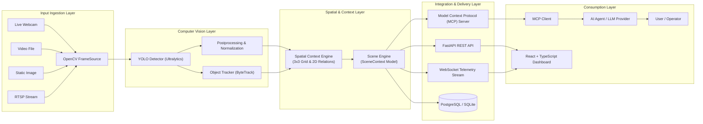

# Architecture Documentation: YOLO + MCP Computer Vision Platform

## 1. Executive Architecture Summary

The **YOLO + MCP Computer Vision Platform** is designed to solve a fundamental architectural challenge in modern Agentic AI: **how to expose rich, real-time computer vision perception to AI agents without blindly shipping massive raw video/image frames to expensive, slow, and hallucination-prone Large Multimodal Models (LMMs).**

By separating raw vision inference from structured semantic context, the platform creates an efficient pipeline:

```
Camera / Image / Video
        ↓
OpenCV Video Capture / Decode
        ↓
YOLO Object Detection (Ultralytics YOLO11 / PyTorch)
        ↓
Post-Processing & Coordinate Bounding
        ↓
Spatial Context Engine (3x3 Grid Sectoring & 2D Relational Extraction)
        ↓
Structured Scene Representation (SceneContext)
        ↓
Model Context Protocol (FastMCP Server)
        ↓
Downstream AI Agent / MCP Client
```

---

## 2. Mermaid Pipeline Diagram



---

## 3. Layer Breakdown

### A. Input Ingestion Layer (`app.vision.sources`)
- Provides an extensible, uniform `FrameSource` interface:
  - `ImageSource`: Static image files with OpenCV validation.
  - `VideoSource`: File iteration with frame skipping/step controls.
  - `WebcamSource`: Real-time capture using DirectShow (Windows) or V4L2 (Linux).
  - `RTSPSource`: Network video streams with reconnection guards.

### B. Vision Layer (`app.vision.detector`, `app.vision.tracker`)
- **Model Decoupling**: Raw YOLO / PyTorch outputs are converted into internal domain models (`Detection`, `BoundingBox`, `Point`). Downstream layers never interact directly with Ultralytics objects.
- **Hardware Acceleration**: Automatic device detection (`auto`, `cpu`, `cuda`). Fails explicitly if CUDA is demanded without hardware support.
- **Trajectory Tracking**: Tracks identity trajectories across frames to calculate 2D velocity vectors (`stationary`, `moving_left`, `moving_right`, `moving_up`, `moving_down`).

### C. Spatial Context Engine (`app.vision.spatial`)
- **3x3 Grid Partitioning**: Divides pixel coordinates into 9 distinct semantic sectors:
  `top-left`, `top-center`, `top-right`, `center-left`, `center`, `center-right`, `bottom-left`, `bottom-center`, `bottom-right`.
- **2D Image-Plane Relationships**:
  - Directional: `left_of`, `right_of`, `above`, `below`.
  - Proximity: `near` (normalized Euclidean distance threshold).
  - Containment: `inside_of`.
- **Truthfulness Standard**: All spatial assertions are strictly 2D image projections. The system never claims 3D depth without dedicated stereoscopic/depth estimation sensors.

### D. Integration & Protocol Layer (`app.mcp.server`, `app.mcp.tools`)
- Implements the official Model Context Protocol (FastMCP) allowing agents in Claude Desktop, Cursor, or autonomous agent frameworks to interact with physical cameras using native typed tool calls and resources.

